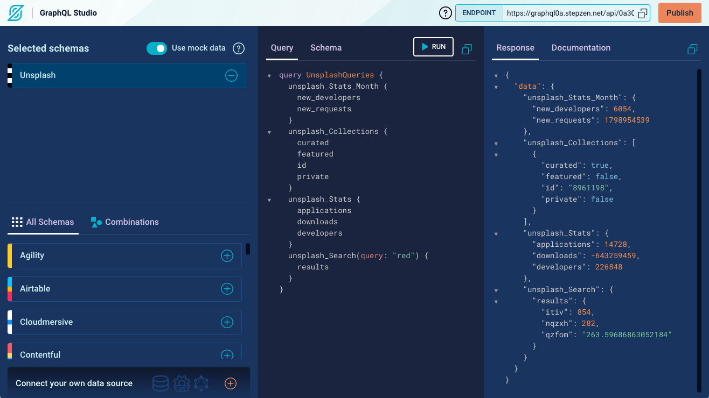
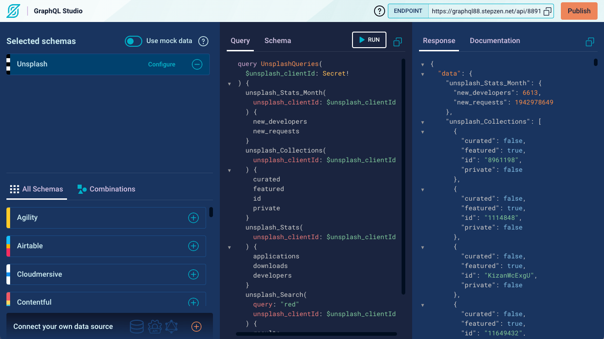

## Advent of GraphQL

**Website**: https://descriptive-snout-e43.notion.site/Advent-of-GraphQL-c69086ae98764e2e9e1ccdd8938dc980

**Description**: A new challenge is unlocked every day. You'll start by making your first query, then move on to making more complex queries in our GraphQL Studio. By the end of the month, you'll have deployed a customized schema to an endpoint you created with StepZen to return a random snowflake from the Unsplash API! ❄️ 

**Project:** [`advent-of-graphql/`](./advent-of-graphql/)

**Status:** ➡️ In progress (0/25) 

## Daily progress

### Day 01: [Make your first GraphQL Query ](https://descriptive-snout-e43.notion.site/Advent-of-GraphQL-c69086ae98764e2e9e1ccdd8938dc980?p=19b7d725e6c2419b919958507ddb2790)


### Day 02: [Explore the Unsplash API](https://descriptive-snout-e43.notion.site/Explore-the-Unsplash-API-14ce8756b1144d4b8225ea4554738a22)


### Day 03: [Download your Unsplash schema](https://descriptive-snout-e43.notion.site/Advent-of-GraphQL-c69086ae98764e2e9e1ccdd8938dc980?p=4d1f91f9a1be45bf858809a6e5b9f839)
- [`e9622c6`](https://github.com/BogDAAAMN/advent-calendar-2021/commit/e9622c62e813628d82add801b776fe2d2b1daba4) Add the graphql Unsplash schema from StepZen Studio

### Day 04: [Get your Unsplash Schema Up & Running](https://descriptive-snout-e43.notion.site/Advent-of-GraphQL-c69086ae98764e2e9e1ccdd8938dc980?p=7cd95d86386448dfa73dfbd6c1c71d1c) 
```bash
% stepzen version
stepzen/0.9.33 darwin-x64 node-v16.1.0
```

### Day 05: [config.yaml](https://descriptive-snout-e43.notion.site/Advent-of-GraphQL-c69086ae98764e2e9e1ccdd8938dc980?p=594c358e3bf746898fb3867d15edcae7)
- [`9d8d9a6`](https://github.com/BogDAAAMN/advent-calendar-2021/commit/9d8d9a6123607d1c9a3e0097329b0ca4ad3a7747) Update `unsplash_clientId` with my Unsplash API Access Key

Learnt that I can reference any environment variable in `config.yaml` as long as it starts with `STEPZEN_`. I works with `.env` files as well, but I exported the variable in the terminal.

```bash
export STEPZEN_UNSPLASH_ACCESS_KEY=my-unsplash-key
```

Then just use its name in the `config.yaml` file without any other notation.

```yml
# config.yaml
configurationset:
  - configuration:
      name: unsplash_config
      unsplash_clientId: STEPZEN_UNSPLASH_ACCESS_KEY
```

Reference: https://dev.stepzen.com/docs/connecting-backends/manage-configuration-and-keys#environment-variables

### Day 06: [Use StepZen to view Unsplash with GraphiQL](https://descriptive-snout-e43.notion.site/Advent-of-GraphQL-c69086ae98764e2e9e1ccdd8938dc980?p=e8264209ccb24dcd88cbc57e47999056)


### Day 07: [Learn about custom directives](https://descriptive-snout-e43.notion.site/Advent-of-GraphQL-c69086ae98764e2e9e1ccdd8938dc980?p=bf548c53162d4078ab6646433fdda7db)
I learnt about graphql custom directives, and the `@rest` directive and the passing of its headers. 

